# GetTogether — Architecture

How Butler is built, as of the submission. Terms are capitalized when they have a precise meaning (Host, Guest, Dinner, Attending, Group thread, ...). The reasoning behind each decision is in [WRITEUP.md](../WRITEUP.md); D1–D15 are indexed at the end.

**Contents**

1. [Overview](#1-overview)
2. [System context](#2-system-context)
3. [Components](#3-components)
4. [Message pipeline](#4-message-pipeline)
5. [Sequences](#5-sequences)
6. [State machines](#6-state-machines)
7. [Data model](#7-data-model)
8. [Trust and privacy](#8-trust-and-privacy)
9. [Decision index](#9-decision-index)

---

## 1. Overview

**Problem.** Dinner parties stall on logistics: chasing RSVPs, collecting Plus-ones and Dietary needs, answering the same questions, keeping everyone updated. **Butler** is an organizer with its own Gmail and Calendar. Hosts and Guests only ever email it; nobody but Butler logs in to anything.

**Built**

| Host | Guest |
|---|---|
| H1 Setup by email; Butler asks for what's missing and shows a draft | G1 RSVP yes/no by email; yes puts them on the Calendar event |
| H2 Approve; Butler creates the Calendar event and emails each Guest privately | G2 Plus-ones, Dietary needs and a note for the Host from the same email |
| H3 Group thread starts at the Group threshold; latecomers get a welcome | G3 Decline gets a thank-you; changing their mind works |
| H4 Changes reach the calendar, the Group thread, and Guests outside it once | G4 Dropping out by email takes them off the calendar; they stay in the Group thread |
| H5 Ask anything; full answers only in the Host thread | G5 Butler stays quiet in the group unless it has a reason to speak |
| H6 Host notes, shareable or private, fixable later | G6 Ask anything; answers only from what Guests may see |
| H8 Cancel, after Butler asks to confirm | G7 Calendar Yes/No/Maybe buttons count; the calendar decides who's coming |

**Fast follows** (designed, not built): Escalations (H7: forward a question Butler can't answer to the Host and relay the answer), Uninvite (H9), catch-up summary for late joiners, calendar "+N" as Plus-ones, nudges, day-of logistics email, +1 policy, personality, multiple Dinners, relay Group thread.

---

## 2. System context

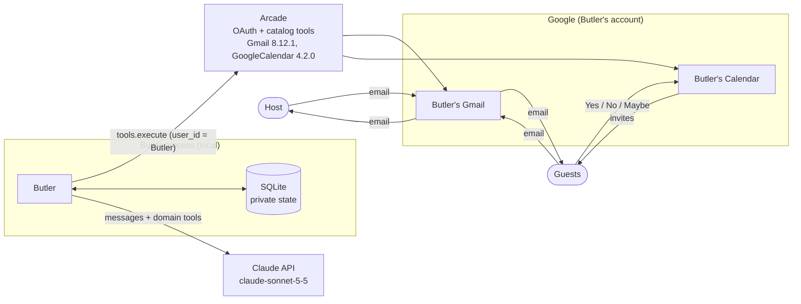

- One Google account (Butler's), authorized once through Arcade (D1). Hosts and Guests authorize nothing.
- Butler polls; nothing pushes to it (D7).
- Claude never talks to Arcade. It calls Butler's domain tools; Butler's code calls Arcade (D2).

---

## 3. Components

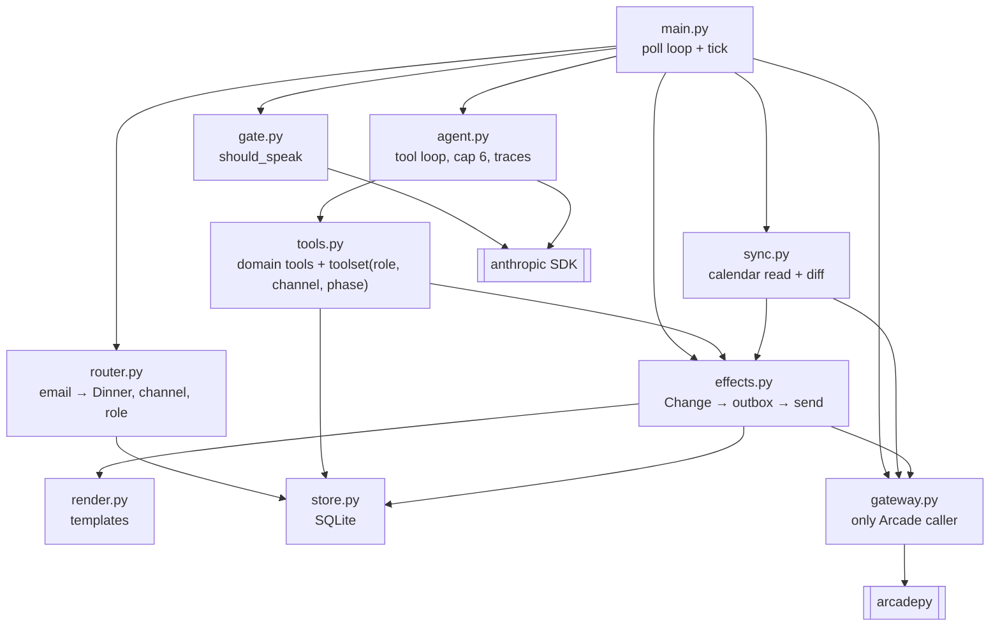

| Module | Owns | Never does |
|---|---|---|
| `router` | Which Dinner, channel (Host / Guest / Group thread), and role (Host / Guest / stranger) an email belongs to, from thread id and sender. Skips Google's and Outlook's Accepted/Declined emails. A Group thread email sent only to Butler is private. | Read the email body |
| `gate` | One structured Claude call: speak or stay silent in the Group thread | Act on anything |
| `agent` | The tool loop: system prompt, thread history, scoped tools, iteration cap, traces | Choose recipients or call Arcade |
| `tools` | Domain tools and which ones exist for (role, channel, phase) | Return data outside the reader's scope |
| `sync` | Per-poll calendar read; turns answer changes into Changes | Email anyone |
| `effects` | Turns an email's net Change into outbox rows; sends pending rows; marks them sent | Decide what the email meant |
| `render` | Every system email, the draft preview and the Calendar description, as templates | Use Claude |
| `store` | SQLite reads/writes, one transaction per processed email | Talk to the network |
| `gateway` | The only module that calls Arcade; normalizes field names | Hold business rules |

**Gateway methods** (the seam tests replace with a fake that mimics real Gmail's recipient derivation and quoting)

| Method | Arcade tool | Notes from the live check |
|---|---|---|
| `search_inbox(after)` → emails | `Gmail.SearchEmailsByQuery` | `in:inbox after:<epoch>`, re-reading 120s back because Gmail indexes some email late; dedupe by message id |
| `get_thread(thread_id)` → emails | `Gmail.GetThread` | Thread history for every Claude call (last 10), and `get_group_thread` |
| `send(to, subject, body, cc)` → message id, thread id | `Gmail.SendEmail` | One `recipient` + `cc`; comma-separated recipients land in spam |
| `reply(message_id, body, cc, to_sender_only)` → message id, thread id | `Gmail.ReplyToEmail` | Quotes the replied-to email; To comes from it; can't set the subject |
| `create_event(title, start, end, place, description, host)` → event id | `GoogleCalendar.CreateEvent` | Notify `all`: Host gets the invite |
| `get_event(event_id)` → attendees + answers | `GoogleCalendar.GetEvent` | `response_status` per attendee |
| `update_event(event_id, start?, place?, description?)` | `GoogleCalendar.UpdateEvent` | Notify `nobody`; returns a string |
| `add_attendee(event_id, email)` | `GoogleCalendar.UpdateEvent` | Notify `all`: only that Guest is emailed |
| `remove_attendee(event_id, email)` | `GoogleCalendar.UpdateEvent` | Notify `nobody` |
| `delete_event(event_id)` | `GoogleCalendar.DeleteEvent` | Notify `nobody`; still takes it off attendees' calendars |

---

## 4. Message pipeline

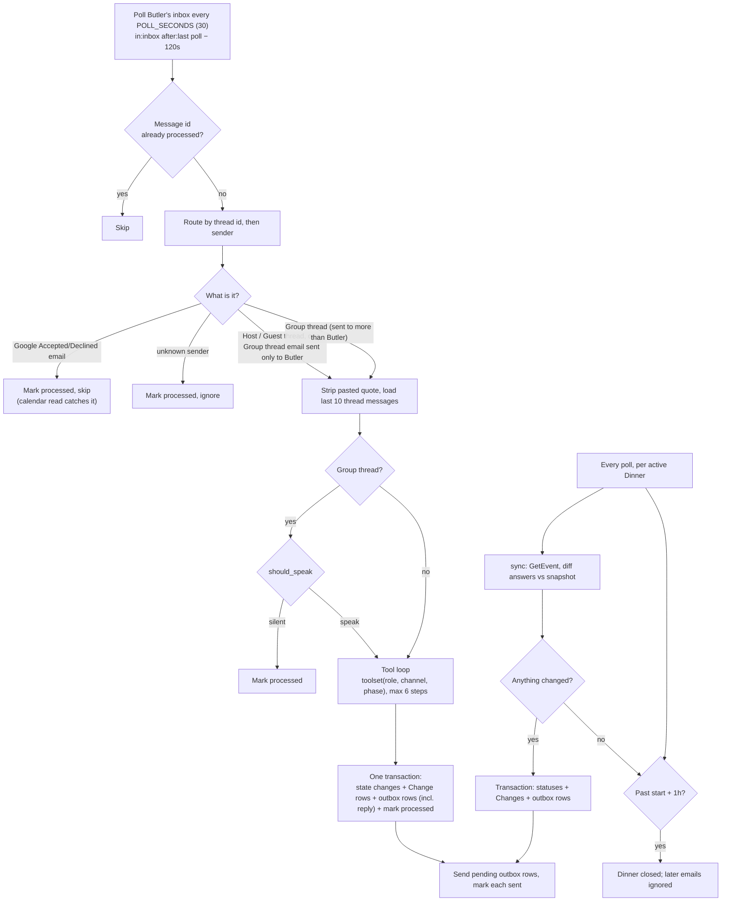

**Why this order:** effects and outbox rows commit together with "processed", so every email is acted on exactly once. Sending is separate and retried from the outbox, so every recipient gets each message exactly once (D5).

---

## 5. Sequences

### 5a. Setup and approval (H1, H2)

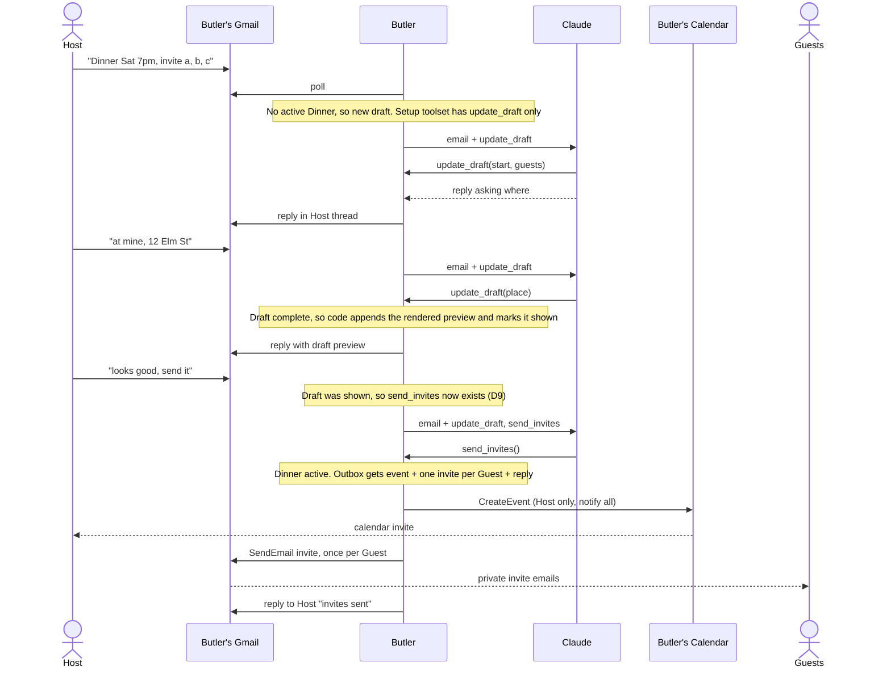

### 5b. Guest says yes and asks a question (G1, G2, G6)

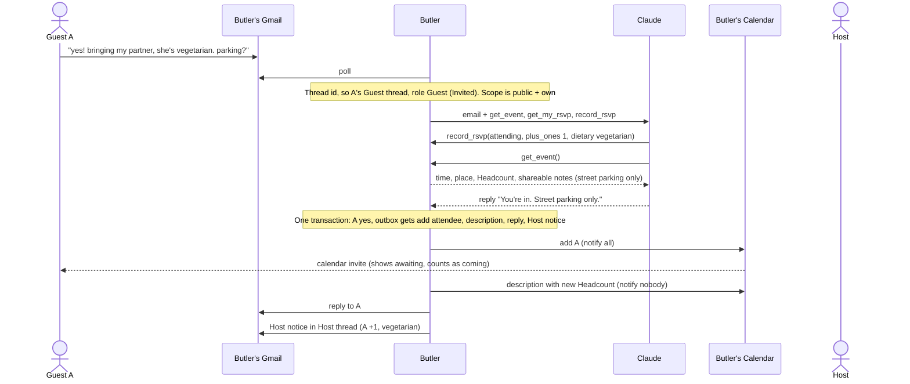

Claude never sees B's or C's Dietary needs here: no tool in A's toolset returns them (D3).

### 5c. Group threshold, chatter, late joiner (H3, G5)

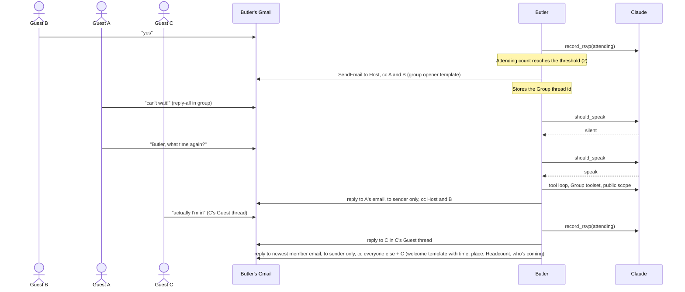

### 5d. Host Change reaches everyone once (H4)

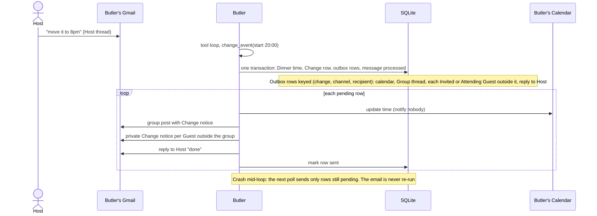

Before the Group thread exists, every Invited and Attending Guest gets the Change privately. If the Host made the Change in the Group thread, the notice rides on Butler's reply there instead of a second post. One Host email is one Change, however many tool calls it took: `effects.host_changes` diffs the Dinner before and after the loop.

### 5e. A Guest declines on the calendar (G7, D13)

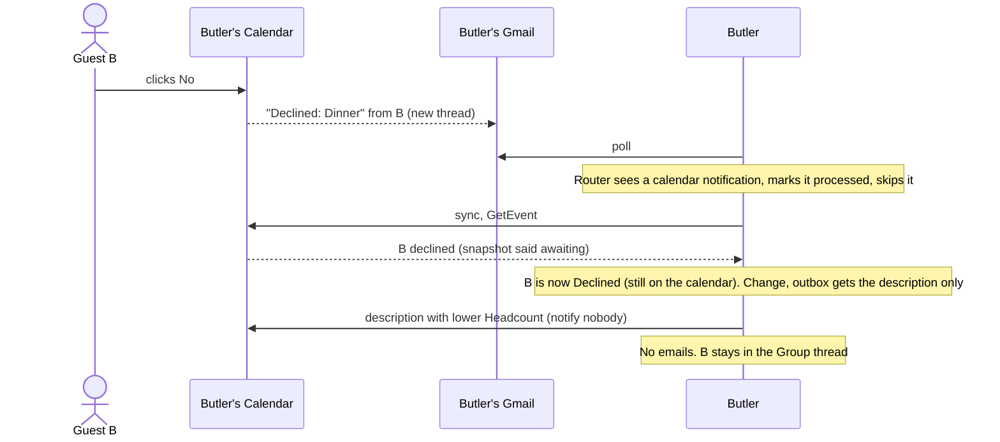

### 5f. Cancel (H8)

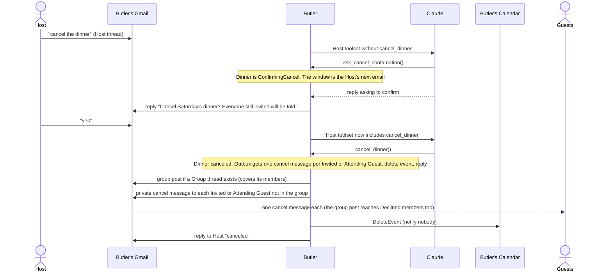

In the Group thread, "cancel" from the Host gets "please confirm with me privately" and nothing changes.

---

## 6. State machines

### Dinner

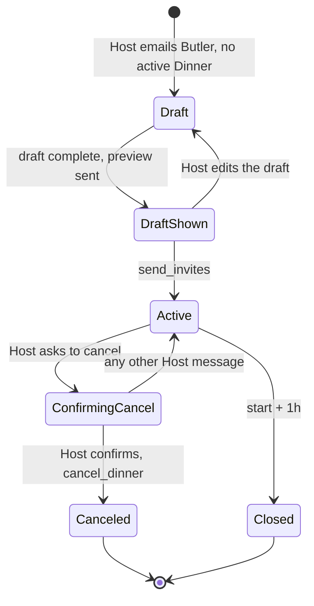

Tools follow state (D9): `send_invites` only in DraftShown, `cancel_dinner` only in ConfirmingCancel. Canceled and Closed Dinners ignore new emails.

### Guest

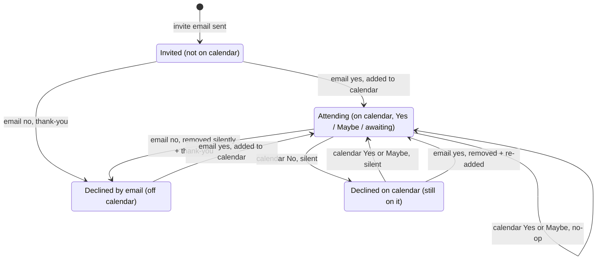

A Guest joins the Group thread (with the welcome) the first time they're Attending after it starts, and never leaves it. Host notices go out for email transitions only; calendar transitions are silent (D13).

---

## 7. Data model

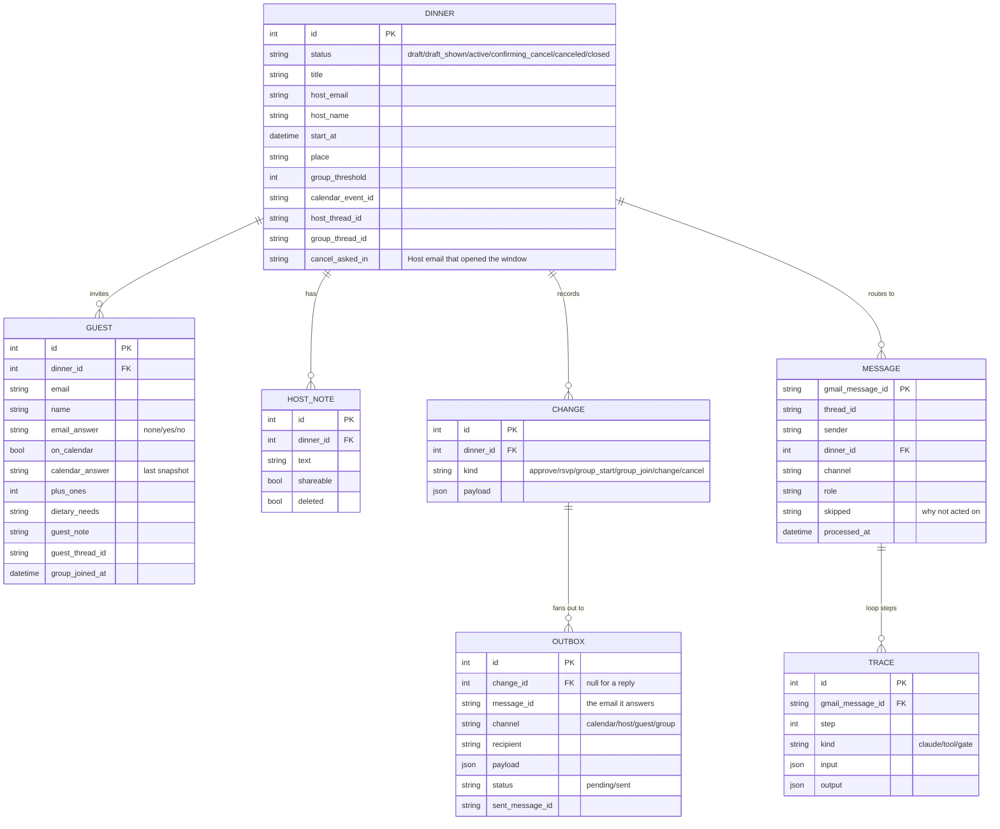

- `OUTBOX` rows belong to a Change, unique on (change, channel, recipient), or answer one inbound email, unique on (message, channel, recipient) (D5).
- Group thread members = Host + Guests with `group_joined_at` set. It's never cleared.
- **A Guest's status is derived, never stored** (D13): on the calendar → Declined if `calendar_answer` is declined, else Attending. Off the calendar → Declined if `email_answer` is no, else Invited.

**What lives on the Calendar event instead**

| Calendar field | Comes from | Who's notified when it changes |
|---|---|---|
| Title, start, end (start + 3h), location | Dinner | nobody (Butler sends its own notice) |
| Description | Rendered from public scope: time, place, Headcount, shareable Host notes | nobody |
| Attendees + answers | Host, Attending Guests, Guests who declined on the calendar. **Source of truth for who's coming** | Added Guest only; removals silent |

---

## 8. Trust and privacy

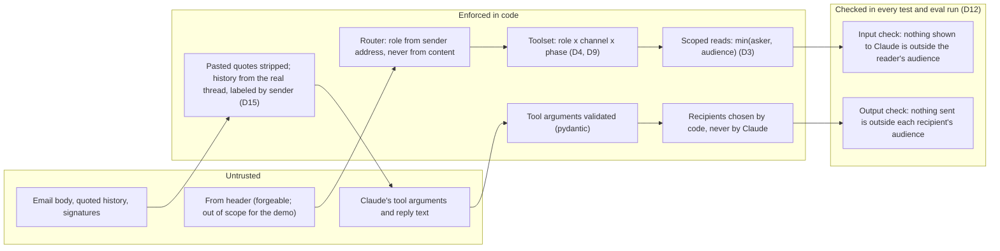

**Scopes** (who may read what)

| Scope | Contents | Readable in |
|---|---|---|
| public | time, place, Headcount, Attending names, shareable Host notes | everywhere |
| group | Group thread emails | Host thread, Attending Guest's thread, Group thread |
| own | the asking Guest's answer, Plus-ones, Dietary needs, Guest note | that Guest's thread |
| private | every Guest's details, private Host notes, Invited and Declined names | Host thread only |

Scope = min(asker, audience): the Host asking in the Group thread gets public + group only, because Guests read the answer.

**Toolsets**

| Tool | Host thread | Host in Group thread | Attending Guest (own thread) or any Guest in Group thread | Invited or Declined Guest (own thread) |
|---|---|---|---|---|
| `get_event` (public) | ✓ | ✓ | ✓ | ✓ |
| `get_group_thread` | ✓ | ✓ | ✓ | |
| `get_my_rsvp` | | | ✓ | ✓ |
| `get_guest_details` (private) | ✓ | | | |
| `record_rsvp(attending, plus_ones?, dietary_needs?, note_for_host?)`, bound to sender; in the Group thread only `attending` and `plus_ones` | | | ✓ | ✓ |
| `change_event(start?, place?)` | ✓ | ✓ | | |
| `add_note(text, shareable)` | ✓ | ✓ | | |
| `invite_guest(email)` | ✓ | ✓ | | |
| `update_note(note, shareable? or delete)` | ✓ | | | |
| `ask_cancel_confirmation()`, opens the cancel window | ✓ | | | |
| `cancel_dinner()`, ConfirmingCancel only | ✓ | | | |
| Setup phase: `update_draft(...)`; `send_invites()` once the draft was shown | ✓ | | | |

**Secrets and their audiences** (the evals' Planted secrets): Dietary needs and Guest notes (Host + that Guest), private Host notes (Host), Invited and Declined identities (Host + that Guest). Never secret: time, place, Attending names, Headcount, shareable Host notes.

---

## 9. Decision index

| # | Decision | One line |
|---|---|---|
| D1 | Butler has its own Google identity | One Arcade grant; Hosts and Guests authorize nothing |
| D2 | Tool loop for conversation, workflow for effects | Compound emails need a loop; the per-role toolset is the permission model |
| D3 | Privacy by construction | Scope = min(asker, audience); no tool returns what the reader can't see |
| D4 | Identity bound by code | `record_rsvp` writes for the sender; Host tools absent from Guest toolsets |
| D5 | Idempotent effects via outbox | Rows keyed (change, channel, recipient); dedupe inbound by message id |
| D6 | Group thread = reply-all with Butler-controlled cc | Relay design is the production upgrade |
| D7 | Polling, not push | 30s poll; Arcade has no inbound trigger (the feature proposal) |
| D8 | Templates for system emails, Claude for conversation | Predictable, testable notices |
| D9 | State-dependent toolsets | Approval and cancel confirmation enforced by which tools exist |
| D10 | Catalog tools only | Gaps (exact recipients, sender authentication) aren't P0 |
| D11 | Evals in pytest | `arcade evals` can't see the loop or the reply, where privacy bugs live |
| D12 | Privacy checked on input and output | Zero tolerance; over-refusal fails too |
| D13 | The calendar decides who's coming | Coming = on it and not declined there; Butler can't set answers |
| D14 | One Dinner at a time | Everything is keyed by Dinner; multiple Dinners mostly means routing fresh emails |
| D15 | Context from the real thread, not pasted quotes | Labeled by real sender, can't be forged, holds only what the thread's readers already got |
